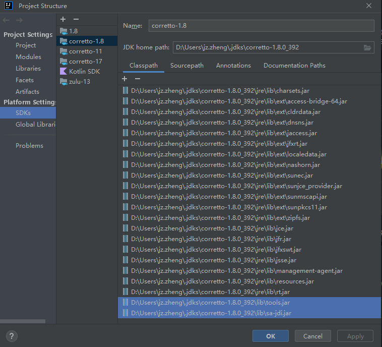

# Conch-SA
Serviceability Agent

DOC:
- [Serviceability in HotSpot](https://openjdk.org/groups/hotspot/docs/Serviceability.html)
- [Serviceability Agent:An out-of-process High Level Debugger for a JVM](https://www.usenix.org/legacy/events/jvm01/full_papers/russell/russell_html/index.html)
- [JVM Memory Structure](https://zhuanlan.zhihu.com/p/451838451)
- https://juejin.cn/post/6992108216695930917
- https://github.com/alibaba/TBJMap


### TODO use shell to 编译

### v9 IDEA 编译+运行
> 前提：将项目配置（Project Structure -> Project）
> - SDK 配置成 JDK 11
> - Language level 配置成 11
### 编译（方式一）
**Windows and Linux**
File | Settings | Build, Execution, Deployment | Compiler | Java Compiler
**MacOS**
IntelliJ IDEA | Settings | Build, Execution, Deployment | Compiler | Java Compiler
在*Override compiler parameters per-module*下的 *conch-sa-core-v9* 后面配置：
```text
--add-modules jdk.hotspot.agent --add-exports jdk.hotspot.agent/sun.jvm.hotspot=ALL-UNNAMED --add-exports jdk.hotspot.agent/sun.jvm.hotspot.classfile=ALL-UNNAMED --add-exports jdk.hotspot.agent/sun.jvm.hotspot.oops=ALL-UNNAMED --add-exports jdk.hotspot.agent/sun.jvm.hotspot.runtime=ALL-UNNAMED --add-exports jdk.hotspot.agent/sun.jvm.hotspot.utilities=ALL-UNNAMED
```

### 编译（方式二：推荐）
在conch-sa/conch-sa-core-v9/pom.xml的
maven-compiler-plugin插件添加配置：
```pom
<configuration>

    ... other config
    
    <compilerArgs>
        <arg>--add-modules</arg>
        <arg>jdk.hotspot.agent</arg>
        <arg>--add-exports</arg>
        <arg>jdk.hotspot.agent/sun.jvm.hotspot=ALL-UNNAMED</arg>
        <arg>--add-exports</arg>
        <arg>jdk.hotspot.agent/sun.jvm.hotspot.classfile=ALL-UNNAMED</arg>
        <arg>--add-exports</arg>
        <arg>jdk.hotspot.agent/sun.jvm.hotspot.oops=ALL-UNNAMED</arg>
        <arg>--add-exports</arg>
        <arg>jdk.hotspot.agent/sun.jvm.hotspot.runtime=ALL-UNNAMED</arg>
        <arg>--add-exports</arg>
        <arg>jdk.hotspot.agent/sun.jvm.hotspot.utilities=ALL-UNNAMED</arg>
    </compilerArgs>
</configuration>
```

### 运行
在 *Run/Debug Configurations* 添加 *Add VM options* 并配置
```text
--add-modules jdk.hotspot.agent --add-exports jdk.hotspot.agent/sun.jvm.hotspot=ALL-UNNAMED --add-exports jdk.hotspot.agent/sun.jvm.hotspot.classfile=ALL-UNNAMED --add-exports jdk.hotspot.agent/sun.jvm.hotspot.oops=ALL-UNNAMED --add-exports jdk.hotspot.agent/sun.jvm.hotspot.runtime=ALL-UNNAMED --add-exports jdk.hotspot.agent/sun.jvm.hotspot.utilities=ALL-UNNAMED
```

### v8 IDEA 编译+运行
> 前提：将项目配置（Project Structure -> Project）
> - SDK 配置成 JDK 8
> - Language level 配置成 8

在 *Project Structure -> SDKs* 对应的1.8的SDK里面新增依赖，如下图：

